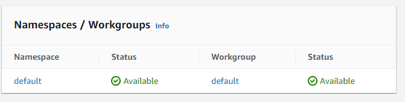
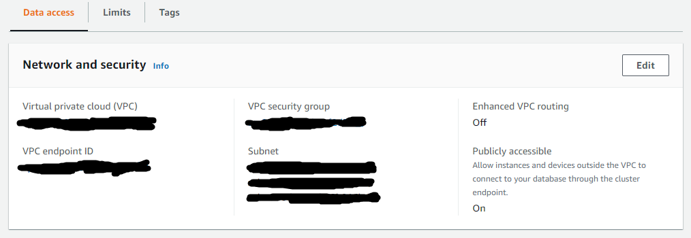
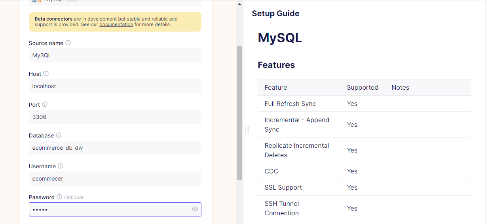
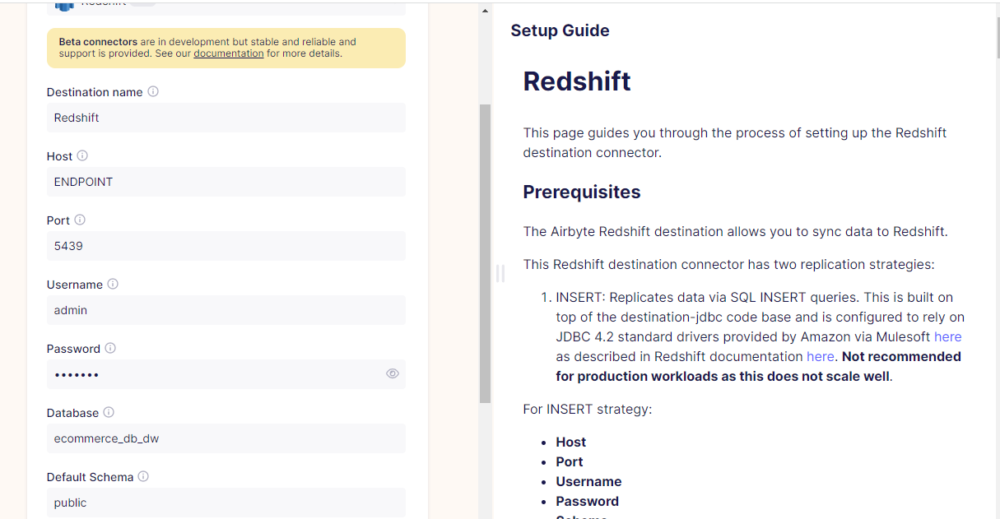
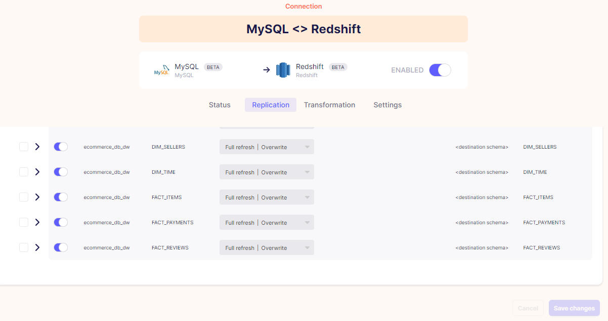
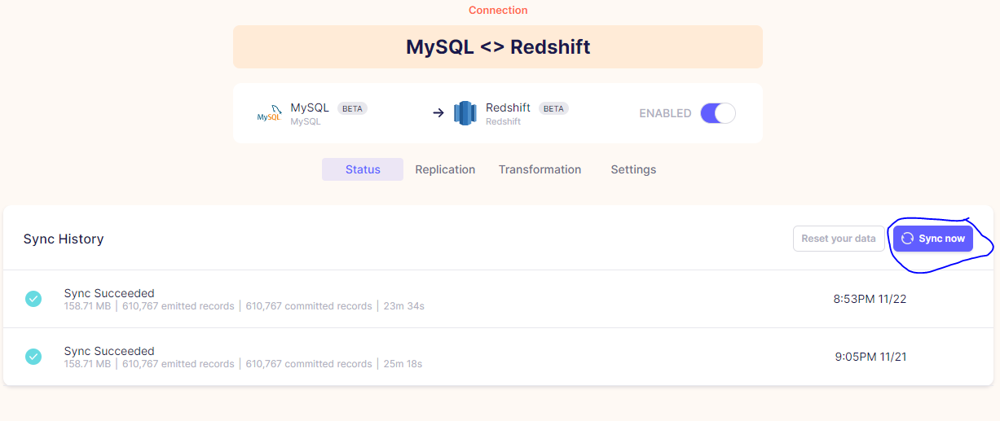

# Datawarehouse a partir de dados de um E-ccomerce
## Introdução
Criação de um datawarehouse a partir de dados extraídos de um e-ccomerce. Os dados vem do kaggle e estão em arquivos .csv.

Esses dados são salvos no MySQL que foi dividido em 3 databases: OLTP, STAGE, DW.

**Tecnologias Usadas**: MySQL, Docker, Power BI, Redshift, Airbyte

## Preparação e Execução do Projeto

### Dados

Os dados podem ser encontrados no seguinte link: https://www.kaggle.com/datasets/olistbr/brazilian-ecommerce?resource=download. Os dados estão em arquivos .csv e são referentes ao período entre 2016 e 2018 de um e-ccomerce.

Pelo link indicado, há mais detalhes sobre como os dados estão distribuídos. O mais importante aqui, é como eles serão usados para montar um datawarehouse.

### Databases

O MSQL foi dividido em **3 databases**. O primeiro deles, é o database para os dados com modelagem OLTP. Aqui os dados são salvos em tabelas que seguirão a mesma estrutura dos arquivos .csv.

O segundo database são para os dados em uma modelagem intermediária entre o OLTP e o datawarehouse. Aqui, as tabelas já são divididas em tabelas fatos e dimensões. São 3 tabelas fatos: pagamentos, avaliações e items. Além disso, esse database possuirá 5 tabelas de dimensão: produtos, vendedores, clientes, tipos de pagamento e pedidos.

O terceiro e último database são para os dados com modelagem OLAP, o datawarehouse propriamente dito. Aqui, além das tabelas fatos e dimensões citadas, existirá mais uma tabela dimensão que é a dimensão tempo.

### Detalhes da Modelagem

Para o database com modelagem OLTP, todas as tabelas possuem chave primária e algumas tabelas usam chaves estrangeiras. Algumas tabelas, contudo, para formar a chave primária, precisam de mais de uma coluna. Para contornar isso, foram tomadas duas ações: criação de uma constraint que determina a combinação de colunas que deve ser única e criação de uma *surrogate key* para que a tabela use apenas uma coluna como chave primária.

Para o database STAGE nenhuma tabela, com exceção da tabela de tipo de pagamento, possui chave primária. O tipo de pagamento é uma tabela que foi montada especificamente para o datawarehouse e serve para normalizar uma coluna de dados da tabela de pagamentos.

Para o database DW, as tabelas voltam a possuir chaves primárias e estrangeiras. Aqui, o maior destaque vai para a dimensão de tempo que visa facilitar a criação de séries temporais. Além disso, as tabelas desse database usam *surrogate keys* (números inteiros que vão de 1 até n) como chave primária. Isso tem como objetivo, melhorar o acesso aos dados oriundos de junções das tabelas fatos e dimensão.

Há também tabelas de dimensão que se comportam como *slowly changing dimension*. Isso significa que se houver alguma mudança, em qualquer linha de dados dessas tabelas, o datawarehouse ainda manterá os dados antigos, mas com uma coluna "FIM" preenchida, que representa o horário da mudança. Os dados novos serão salvos em uma nova linha que possuirá o mesmo "ID" (puxados da modelagem OLTP), mas diferentes *surrogate keys*.

Os dados de tempo presentes na tabela fato serão chaves estrangeiras que apontam para a dimensão de tempo.

### Execução do projeto

#### Criação do Datawarehouse no MySQL

Primeiro é necessário instalar o MySQL. Isso pode ser feito através do script Docker presente no repositório.

Com o MySQL instalado, é possível criar o datawarehouse. Para isso basta seguir a sequência de scripts dentro da pasta SQl. Esses scripts estão com números que representam a ordem de execução.

Para garantir o carregamento dos dados, foi necessário alterar a linha 82209 do arquivo olist_order_reviews_dataset.csv. A alteração foi retirar os caracteres /". Além disso, foi necessário, acrescentar 3 linhas de dados ao arquivo product_category_name_translation.csv:

seguros_e_servicos,security_and_services

pc_gamer,pc_gamer

portateis_cozinha_e_preparadores_de_alimentos,portables_kitchen_and_food_preparers

### Exemplo de Dashboard Simples

Com o datawarehouse criado, é possível realizar análises. O dashboard, que pode ser acessado pelo link abaixo, mostra uma maneira simples de exibir os dados.

https://app.powerbi.com/view?r=eyJrIjoiNGE1MWVhODYtNWIyNy00NDY4LWIzZTUtZWU0YWNmZTcyZDE4IiwidCI6ImQwZWVhODVjLTExZWUtNDI0ZC04NzRjLWY2YTA3ZTY2MjVkMCJ9&pageName=ReportSection

### Extra: Transferir DW para Nuvem

Os dados do DW construído no MySQL podem ser facilmente transferidos para algum ambiente na nuvem, de maneira simples, através do Airbyte.

Para isso, é necessário instalar o Airbyte, que pode ser feito facilmente, seguindo as instruções da documentação, através do seguinte link: https://docs.airbyte.com/quickstart/deploy-airbyte/?_gl=1*tbs8gi*_gcl_aw*R0NMLjE2NjI1[%E2%80%A6]vy1Jg9KFWpD289ItJx-G1t_wNseJkR918bNkOOX59yyqlMUaAiAmEALw_wcB&_ga=2.111747788.970858467.1669239778-623541937.1669239751.

O ambiente em nuvem usado será o AWS Redshift Serveless. Para configura-lo é simples, basta acessar a página inicial do Redshift e escolher a opção de configurar o AWS Redshift Serveless. Existem algumas opções de configuração, mas para esse exemplo, apenas duas são necessárias: uma é a criação de um usuário e senha de administrador e a outra é garantir que o grupo de segurança aceite, como regra de entrada, o IP de onde será configurado a conexão do Airbyte.

Com a instância do Redshift Serveless criada, será necessário algumas configurações. A primeira é entrar no editor de queries e executar o seguinte comando:

<code>
create database ecommerce_db_dw;
 
</code>

A segunda é garantir que o banco de dados seja acessível publicamente. Para isso, na área de dashboard do Redshift Serveless, procure a parte de "Namespaces/Groups" e clique no link disponível do workgroup. Isso levará até outra página. Então, em "Network and security", clique em Edit e marque e salve a opção Publicly accessible. Os prints abaixo podem ser utéis:

Com o Redshift configurado, é necessário configurar o Airbyte. Isso é feito em 3 etapas: configuração da fonte, destino e conexão.

Para configurar a fonte (MySQL), basta informar os dados de: IP da máquina onde está o MySQL (host), database, usuário e senha. O print abaixo podem ser util:

Para configurar o destino, basta informar os alguns dados. Para configurar o host, entre novamente no link do workgroup, e em "Namespaces/Groups" procure, copie e cole a informação do Endpoint (mantenha o texto apenas até o .com). Além disso, informe os dados de database, usuário (usuário adiministrador) e senha. Os prints abaixo podem ser utéis:

Para configurar a conexão, basta informar as fontes e destinos criados. Não é necessário alterar mais nenhum parâmetro, e com isso a conexão estará criada. Após isso, basta testar manualmente a replicação. Os prints abaixo podem ser utéis:

